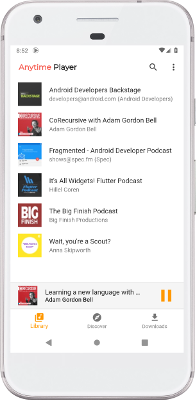
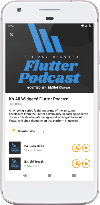
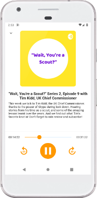
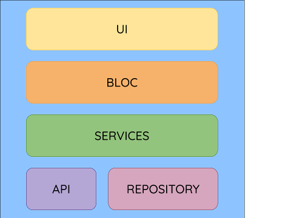

## Anytime Podcast Player

This is the official repository for the Anytime Podcast Player - the simple Podcast playing app built with Dart & Flutter.
***



## Getting Started

Anytime is currently in *Alpha* - so please expect bugs! It also only supports Android at this time.
A version for iOS is in the works, but is slower going as I do not have any Apple
hardware to build or test on.

#### Testers

I am looking for a few people to help me test the binaries on the Google Play Store
in a closed Alpha test. If you would be willing to help me, please drop me an email
at [anytime@amugofjava.me.uk](mailto:anytime@amugofjava.me.uk) or raise a GitHub issue.
Once Anytime is out of Alpha I will move to an open Beta test on the Play Store.

#### Building from source

If you do not have the Flutter SDK installed, follow the instructions from the
Flutter site [here](https://flutter.dev/docs/get-started/install).

To build from source fetch the latest from master:

```
git clone https://github.com/amugofjava/podcast_search.git
```

From the anytime directory fetch the dependencies:

```
flutter packages get
```

Then either run:

```
flutter run
```

Or build:

```
flutter build apk
```


## Built With

Anytime makes use of several amazing packages available on [pub.dev](https://pub.dev). Below is a list of the packages that
are heavily used within the application.

* [Flutter](https://flutter.dev/) - SDK.
* [Sembast](https://pub.dev/packages/sembast) - NoSQL persistent store.
* [RxDart](https://pub.dev/packages/rxdart) - adds additional capabilities to Dart Streams and StreamControllers.
* [Audio Service](https://pub.dev/packages/audio_service) - Provides background support for supporting audio libraries.
* [Podcast Search](https://pub.dev/packages/podcast_search) - Provides podcast search and parsing.

## Architecture



Anytime takes a layered approach:

* UI - The UI presented to the users. Currently this is mobile, but could be extended to web and/or desktop in the future.
* BLoC - Handles the state for the UI. Communication between the UI and BLoC is entirely via Sinks and Streams.
* Services - Interacts with the API and Repository to provide data handling routines to the BLoCs and other services.
* API - Interacts with the iTunes API (via a package) to fetch and parse podcast data.
* Repository - Provides persistent storage.

## Contributing

If you have an issue or discover a bug, please raise a GitHub issue. Pull requests are also welcome.

## Have a question?

If you wish to reach out to me directly you can find me at [anytime@amugofjava.me.uk](mailto:anytime@amugofjava.me.uk).

## License

Anytime is released under a BSD-Style License. See the LICENSE file for further details.