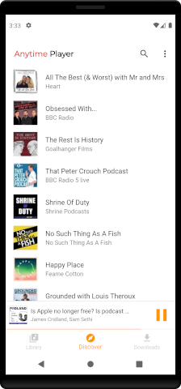
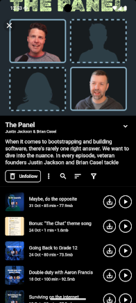
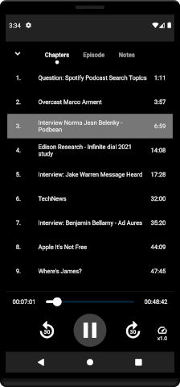
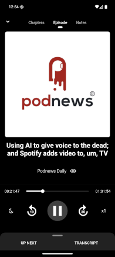

## Anytime Podcast Player

This is the official repository for Anytime Podcast Player - the simple and easy to use Podcast playing 
app for Android & iOS, built with Dart & Flutter.
***
Latest build status

[](https://codemagic.io/apps/5ee1c043c2d4735b25c146a5/5ee1c043c2d4735b25c146a4/latest_build)
***

&nbsp;
&nbsp;
&nbsp;
&nbsp;

## Getting Started

Anytime is currently at v1.3.x and is built against Flutter 3.29.2+. View
the [project](https://github.com/amugofjava/anytime_podcast_player/projects/1) to see what is
currently being worked on.

The official website can be found at [https://anytimeplayer.app](https://anytimeplayer.app)

### Testers

If you would like to help test Anytime please click the image below to head over to the Play Store,
or Amazon App Store.
You can download the current stable release or sign up to the Beta channel and help test
current developments.

<a href='https://play.google.com/store/apps/details?id=uk.me.amugofjava.anytime&pcampaignid=pcampaignidMKT-Other-global-all-co-prtnr-py-PartBadge-Mar2515-1'></a>
&nbsp;
<a href="https://www.amazon.com/gp/product/B09C4J7NL5"></a>
<a href="https://apps.apple.com/us/app/anytime-podcast-player/id1582300839#?platform=iphone"></a>

I would really appreciate all feedback - positive and negative - as it both helps improve Anytime
and prioritise new features. You can reach me
at [hello@anytimeplayer.app](mailto:hello@anytimeplayer.app).

### Building from source

If you do not already have the Flutter SDK installed, follow the instructions from the
Flutter site [here](https://flutter.dev/docs/get-started/install).

Fetch the latest from master:

```
git clone https://github.com/amugofjava/anytime_podcast_player.git
```

From the anytime_podcast_player directory fetch the dependencies:

```
flutter packages get
```

Then either run:

```
flutter run
```

Or build:

```
flutter build apk
```

### Search Engines

Anytime can search for podcasts via iTunes and PodcastIndex. To use PodcastIndex, first create
an account at [https://podcastindex.org](https://podcastindex.org). This will generate the required
key
and secret. To enable searching with PodcastIndex in AnyTime, pass the key and secret as runtime
arguments:

```
flutter run --dart-define=PINDEX_KEY=mykey --dart-define=PINDEX_SECRET=mysecret
```

If running from Android Studio, add the following to the command line arguments section:

```
-t lib/main.dart --dart-define=PINDEX_KEY=mykey --dart-define=PINDEX_SECRET=mysecret
```

Ensure there are is only a single space between each argument. I have found that an additional space
between any
of the arguments will prevent them from being passed into Flutter correctly.

## Open with Anytime links

Anytime supports deep linking from websites, allowing you to open a podcast within Anytime from a
web url. To open a feed
within Anytime, you create a link to the Anytime website passing in the URL of the feed you
wish to open. For example: to load a feed in Anytime from www.example.com you would use the
following link:

https://anytimeplayer.app/subscribe?url=www.example.com/myfeed.xml

## Built With

Anytime makes use of several amazing packages available on [pub.dev](https://pub.dev). Below is a
list of the packages that
are heavily used within the application.

* [Flutter](https://flutter.dev/) - SDK.
* [Sembast](https://pub.dev/packages/sembast) - NoSQL persistent store.
* [RxDart](https://pub.dev/packages/rxdart) - adds additional capabilities to Dart Streams and
  StreamControllers.
* [Audio Service](https://pub.dev/packages/audio_service) - Provides background support for audio
  playback.
* [Podcast Search](https://pub.dev/packages/podcast_search) - Provides podcast search and parsing.

## Architecture


Anytime takes a layered approach:

* UI - The UI presented to the users. Currently this is mobile, but could be extended to web and/or
  desktop in the future.
* BLoC - Handles the state for the UI. Communication between the UI and BLoC is entirely via Sinks
  and Streams.
* Services - Interacts with the API and Repository to provide data handling routines to the BLoCs
  and other services.
* API - Interacts with the iTunes API (via a package) to fetch and parse podcast data.
* Repository - Provides persistent storage.

## Supporting

Anytime is free and open source software. If you would like to help support the development of Anytime,
please consider donating a tea. Anytime is fuelled by caffeine! Please checkout the 
GitHub [sponsors](https://github.com/sponsors/amugofjava) link or my [ko-fi](https://ko-fi.com/amugofjava) page.

<a href='https://ko-fi.com/amugofjava'></a>

## Contributing

If you have an issue or discover a bug, please raise a GitHub issue. Pull requests are also welcome.
Full details can be found in [CONTRIBUTING.md](CONTRIBUTING.md).

You can help to translate the app on [Weblate](https://toolate.othing.xyz/projects/anytime-podcast/)

[](https://toolate.othing.xyz/projects/anytime-podcast/)

See [TRANSLATION.md](./TRANSLATION.md) for details.

## Have a question?

If you wish to reach out to me directly you can find me
at [hello@anytimeplayer.app](mailto:hello@anytimeplayer.app).

## License

Anytime is released under a BSD-Style License. See the LICENSE file for further details.
